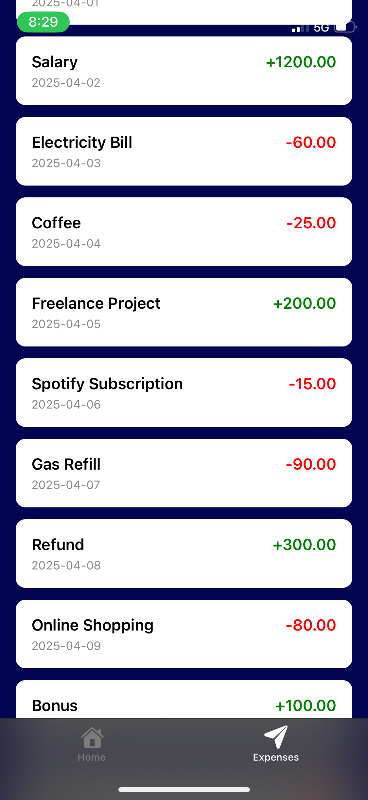

# Digital Bank App

A mobile app that allows users to securely view their transaction history and details through biometric authentication (Face ID/Touch ID) and view expenses. Built with React Native, Expo, and integrated with biometric login for secure access.

<br><br>

<br><br>

<br><br>

<br><br>

<br><br>

<br><br>

## Features

- **Biometric Authentication**: Users can authenticate with Face ID or Touch ID to access their transaction details securely.
- **Transaction History**: Users can view a list of transactions, with the option to reveal the amount and details after authentication.
- **Responsive UI**: Built with React Native and Expo, making it a cross-platform mobile app for iOS and Android.
- **Transaction Details**: Tap on a transaction to view detailed information such as amount, description, and type of transaction.

## Installation

### Prerequisites

- **Node.js** (>=14.x.x)
- **Expo CLI**: Install the Expo CLI globally via `npm install -g expo-cli`
- **Git**: For version control and collaboration.

### Steps

1. Clone the repository:

   ```bash
   git clone https://github.com/your-username/digital-bank-app.git
   cd digital-bank-app
   ```
